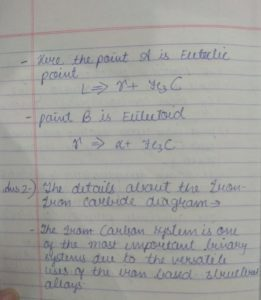
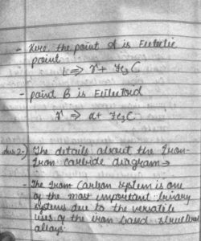
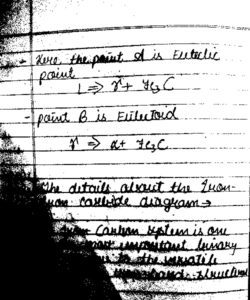
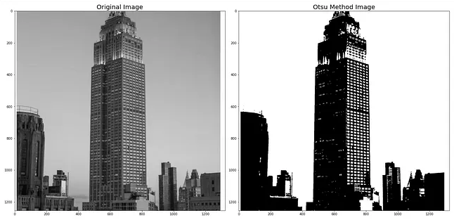

# ocr-thesis-2025

Bachelor thesis project comparing OCR engines (Tesseract, Google Vision, AWS Textract) on logistics-related documents, with focus on preprocessing effects.  
OCR: https://github.com/UB-Mannheim/tesseract/wiki

## Preprocessing:

* **CLAHE**: https://www.geeksforgeeks.org/clahe-histogram-eqalization-opencv/  
  * Contrast adjustment on segmentated image

  | Original | CLAHE Applied | Enhanced Contrast |
  |:--------:|:-------------:|:-----------------:|
  |  |  |  |
  | *Input image* | *Local histogram equalization* | *Improved contrast & detail* |

* **OTSU**: https://medium.com/@vignesh.g1609/image-segmentation-using-otsu-threshold-selection-method-856ccdacf22  
  * Binarization on grayscaled image

  | OTSU Thresholding |
  |:------------------:|
  |  |
  | *Binary image using OTSU method* |

## Other:

* **Blur**: reduce noise  
* **Sharpening**: increase contrast between pixels
